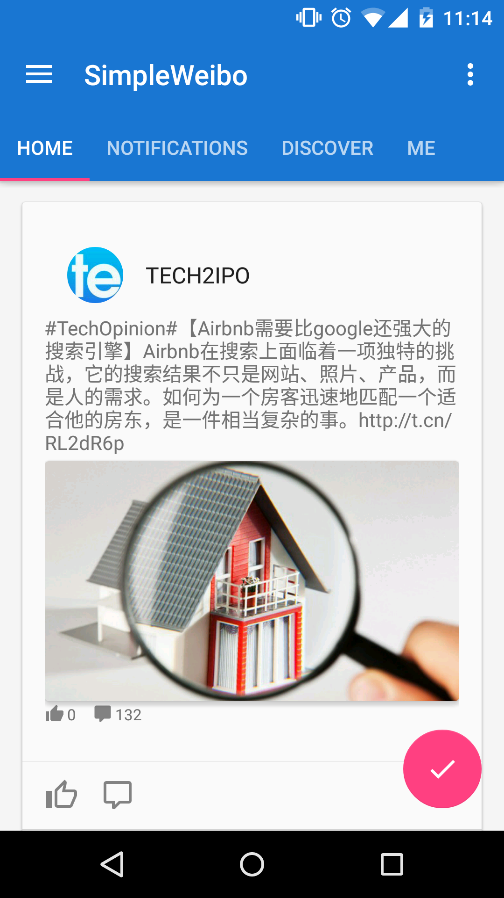

# SimpleWeibo

[](https://gitter.im/8tory/SimpleWeibo?utm_source=badge&utm_medium=badge&utm_campaign=pr-badge&utm_content=badge)

[](https://travis-ci.org/8tory/SimpleWeibo)

[](https://github.com/Wendly)
[](https://github.com/yongjhih)
Contributors..


Simple Weibo SDK turns Weibo API into a Java interface with RxJava.

[#Demo](#demo)



## Usage

My posts:

```java
weibo = SimpleWeibo.create(activity);

Observable<Status> myStatuses = weibo.getStatuses();
myStatuses.take(10).forEach(System.out::println);
```

logIn (default permissions):

```java
weibo.logIn().subscribe();
```

logInWithPermissions:

```java
weibo.logInWithPermissions(Arrays.asList("email", "statuses_to_me_read")).subscribe();
```

## Integration

AndroidManifest.xml:

```xml
<meta-data android:name="com.sina.weibo.sdk.ApplicationId" android:value="@string/weibo_app_id" />
<meta-data android:name="com.sina.weibo.sdk.RedirectUrl" android:value="@string/weibo_redirect_url" />
```

Activity:

```java
SimpleWeibo weibo;

@Override
protected void onCreate(Bundle savedInstanceState) {
    super.onCreate(savedInstanceState);

    weibo = SimpleWeibo.create(activity);
}

@Override
protected void onActivityResult(int requestCode, int resultCode, Intent data) {
    super.onActivityResult(requestCode, resultCode, data);
    weibo.onActivityResult(requestCode, resultCode, data);
}
```


## Add API using RetroWeibo

Ready API:

[SimpleWeibo.java](simpleweibo/src/main/java/com/sina/weibo/simple/SimpleWeibo.java):

```java
    @GET("/statuses/friends_timeline.json")
    public abstract Observable<Status> getStatuses(
        @Query("since_id") long sinceId,
        @Query("max_id") long maxId,
        @Query("count") int count,
        @Query("page") int page,
        @Query("base_app") boolean baseApp,
        @Query("trim_user") boolean trimUser,
        @Query("feature") int featureType
    );

    public Observable<Status> getStatuses() {
        // ...
    }

    @GET("/mentions.json")
    public abstract Observable<Status> getMentionedStatuses(
        @Query("since_id") long sinceId,
        @Query("max_id") long maxId,
        @Query("count") int count,
        @Query("page") int page,
        @Query("filter_by_author") int filterByAuthor,
        @Query("filter_by_source") int filterBySource,
        @Query("filter_by_type") int filterByType,
        @Query("trim_user") boolean trimUser
    );

    public Observable<Status> getMentionedStatuses() {
        // ...
    }

    @GET("/users/show.json")
    public abstract Observable<User> getUsersById(@Query("uid") long uid);

    @GET("/users/show.json")
    public abstract Observable<User> getUsersByName(@Query("screen_name") String screenName);

    @GET("/users/domain_show.json")
    public abstract Observable<User> getUsersByDomain(@Query("domain") String domain);

    @GET("/users/counts.json")
    public abstract Observable<User> getUsersCount(@Query("uids") long[] uids);

    @GET("/comments/show.json")
    public abstract Observable<Comment> getCommentsById(
        @Query("id") int id,
        @Query("since_id") long sinceId,
        @Query("max_id") long maxId,
        @Query("count") int count,
        @Query("page") int page,
        @Query("filter_by_author") int filterByAuthor
    );

    public Observable<Comment> getCommentsById(int id) {
        // ...
    }

    @GET("/comments/by_me.json")
    public abstract Observable<Comment> getCommentsByMe(
        @Query("since_id") long sinceId,
        @Query("max_id") long maxId,
        @Query("count") int count,
        @Query("page") int page,
        @Query("filter_by_source") int filterBySource
    );

    public Observable<Comment> getCommentsByMe() {
        // ...
    }

    public Observable<Comment> getCommentsByMe(int filterBySource) {
        // ...
    }

    @GET("/comments/to_me.json")
    public abstract Observable<Comment> getCommentsToMe(
        @Query("since_id") long sinceId,
        @Query("max_id") long maxId,
        @Query("count") int count,
        @Query("page") int page,
        @Query("filter_by_author") int filterByAuthor,
        @Query("filter_by_source") int filterBySource
    );

    public Observable<Comment> getCommentsToMe() {
        // ...
    }

    public Observable<Comment> getCommentsToMe(int filterByAuthor, int filterBySource) {
        // ...
    }

    @GET("/comments/timeline.json")
    public abstract Observable<Comment> getComments(
        @Query("since_id") long sinceId,
        @Query("max_id") long maxId,
        @Query("count") int count,
        @Query("page") int page,
        @Query("trim_user") boolean trimUser
    );

    public Observable<Comment> getComments() {
        // ...
    }

    public Observable<Comment> getComments(boolean trimUser) {
        // ...
    }

    @GET("/comments/mentions.json")
    public abstract Observable<Comment> getMentionedComments(
        @Query("since_id") long sinceId,
        @Query("max_id") long maxId,
        @Query("count") int count,
        @Query("page") int page,
        @Query("filter_by_author") int filterByAuthor,
        @Query("filter_by_source") int filterBySource
    );

    public Observable<Comment> getMentionedComments() {
        // ...
    }

    public Observable<Comment> getMentionedComments(int filterByAuthor, int filterBySource) {
        // ...
    }

    @GET("/comments/show_batch.json")
    public abstract Observable<Comment> getBatchComments(@Query("cids") long[] cids);
```

Add Model: [Status.java](simpleweibo/src/main/java/com/sina/weibo/simple/Status.java):

```java
@AutoJson
public abstract class Status implements android.os.Parcelable {
    @Nullable
    @AutoJson.Field(name = "created_at")
    public abstract String createdAt();
    @Nullable
    @AutoJson.Field
    public abstract String id();
    // ...
}
```

## Demo

* Sample code: [MainActivity.java](simpleweibo-app/src/main/java/com/sina/weibo/simple/app/MainActivity.java)
* apk: https://github.com/8tory/SimpleWeibo/releases/download/1.0.0/simpleweibo-app-debug.apk

## Installation

via jitpack:

```gradle
repositories {
    maven {
        url "https://jitpack.io"
    }
}

dependencies {
  compile 'com.github.8tory.SimpleWeibo:simpleweibo:-SNAPSHOT'
}
```

via jcenter(in progress):

```gradle
repositories {
    jcenter()
}

dependencies {
  compile 'com.infstory:simpleweibo:1.0.0'
}
```

## See Also

* http://open.weibo.com/wiki/

## License

```
Copyright 2015 8tory, Inc.

Licensed under the Apache License, Version 2.0 (the "License");
you may not use this file except in compliance with the License.
You may obtain a copy of the License at

    http://www.apache.org/licenses/LICENSE-2.0

Unless required by applicable law or agreed to in writing, software
distributed under the License is distributed on an "AS IS" BASIS,
WITHOUT WARRANTIES OR CONDITIONS OF ANY KIND, either express or implied.
See the License for the specific language governing permissions and
limitations under the License.
```
